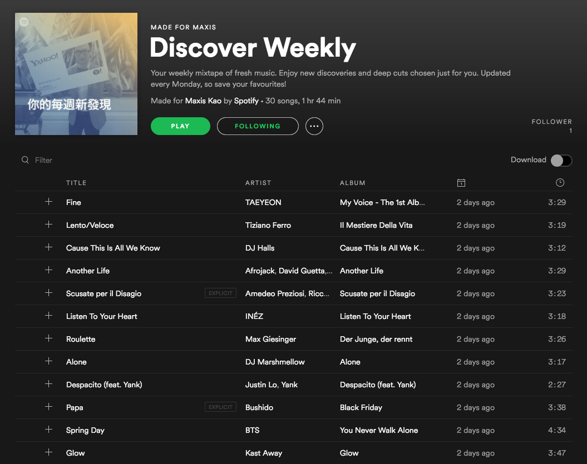

**<span style="color: #1ec15e">Spotify</span>**
Discover Weekly

<small>Maxis / Oct. 18</small>

---



---

## What is it?

- A playlist

- Update on Monday

- 30 songs

- personalized music

- 電腦選的

---

### People says

<small>

_"It's scary how well Spotify Discover Weekly playlists know me."_ <br /> @Dave_Horwitz

</small>

---

## Music curation

1. Songza
2. Pandora
3. The Echo Nest

---

### 3 Types of Recommendation Models

+++

### 3 Types of Recommendation Models

1. _Collaborative Filtering_
2. _Natural Language Processing_ (NLP)
3. _Audio_ models

---

### Recommendation Model #1
**<span style="color: #1da2b1">Collaborative Filtering</span>**

+++

**<span style="color: #e40a13">Netflix</span>**

uses **stars** to identify similar **users**

+++

**<span style="color: #1ec15e">Spotify</span>**

- **stream counts** of the tracks we listen to
- **save** a track to a playlist

+++

#### how it works?

+++

**Example**

<small>3 people: **Ian**, **Ben**, **Freda**, and 3 songs: **A**, **B**, **C**</small>

```
  Ian: A, B, -

  Ben: A, B, C


Freda: -, B, -
```

+++

**Goal**

<small>Find the most similar user and recommend the missing song</small>

```
  Ian: A, B, - <-- maybe Ian will like song C

  Ben: A, B, C


Freda: -, B, -
```

+++

#### Geek part

How to solve this, technically?

+++

Formulate the problem

<small>Matrix Representation</small>

```
  Ian: A, B, -

  Ben: A, B, C


Freda: -, B, -
```

```python
#    A   B   C
[
  [ 10,  9,  0 ],  # Ian
  [ 10, 10,  2 ],  # Ben
  [  0, 30,  0 ]   # Freda
]
```

+++

Digging

<small>Find **user tastes** and **song profiles**</small>

+++

Matrix Factorization <small>(矩陣分解)</small>

```python
# user_taste
array([[ 2.04866803,  1.06036415],  # Ian
      [ 1.67149808,  1.48183269],   # Ben
      [ 3.31190832,  5.30993009]])  # Freda
```

```python
# song_profile
array([[ 3.31789529,  2.99977495],  # Song A
       [ 2.17870507,  4.28717593],  # Song B
       [ 1.23949257,  1.97282136]]) # Song C
```

+++

<small>After calculating the **cosine similarity** between each vector pair, <br /> we know that Ian and Ben has **more similar** music taste than Freda.</small>

```python
# user_taste
array([[ 2.04866803,  1.06036415],  # Ian
      [ 1.67149808,  1.48183269],   # Ben
      [ 3.31190832,  5.30993009]])  # Freda
```

```python
cosine_similarity(Ian, Ben):   0.97
cosine_similarity(Ian, Freda): 0.86
```

+++

Bingo!

```
  Ian: A, B, C <--

  Ben: A, B, C


Freda: -, B, -
```

---

### Recommendation Model #2
**<span style="color: #1da2b1">Natural Language Processing (NLP)</span>**

+++

1. sentiment analysis
  <small>what <span style="color: #1da2b1">adjectives</span> and <span style="color: #1da2b1">language</span> is frequently used about those songs</small>

2. cultural vectors


---

### Recommendation Model #3
**<span style="color: #1da2b1">Raw Audio Models</span>**

+++

**Why raw audio?**

Unlike the first two model types, raw audio models take into account <span style="color: #1ec15e">new</span> songs.

+++

**How?**

+++

Convolutional Neural Networks (CNN)

<small>They transform the audio into time-frequency representations as input</small>


+++

output

<small>audio characteristics like pitch, tempo, and loudness</small>


<small>Around the World” by Daft Punk</small>
<i>Image Credit: Tristan Jehan & David DesRoches (The Echo Nest)</i>

---

### That's it

<br/> Enjoy your <span style="color: #1ec15e">Discover Weekly</span> 😛

---

Sources

<small style="line-height: 2;">
- [From Idea to Execution: Spotify’s Discover Weekly](https://www.slideshare.net/MrChrisJohnson/from-idea-to-execution-spotifys-discover-weekly)
- [Collaborative Filtering at Spotify](http://benanne.github.io/2014/08/05/spotify-cnns.html)
- [Spotify’s Discover Weekly: How machine learning finds your new music](https://hackernoon.com/spotifys-discover-weekly-how-machine-learning-finds-your-new-music-19a41ab76efe)

</small>
